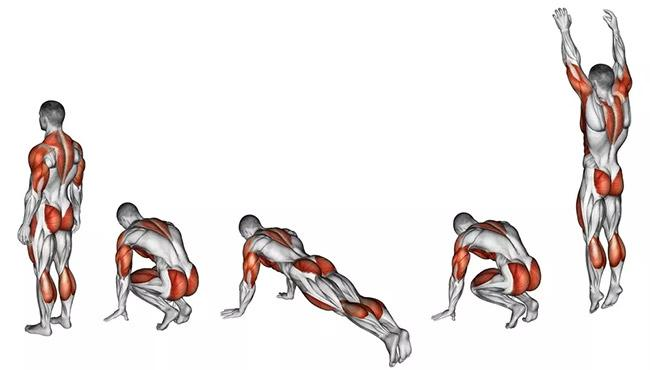

# 📋 Complete Summary - Decathlon AI Sport Coach

## ✅ What's Been Created

Your Decathlon AI Sport Coach application is **100% ready** with these features:

### 🎯 Core Features
- ✅ **Groq AI Integration** - Real-time intelligent recommendations
- ✅ **Smart Exercise Mapping** - 16 exercises with automatic image matching
- ✅ **Product Links** - Direct Decathlon shop links on each exercise
- ✅ **Beautiful Modern UI** - Glassmorphism, animations, responsive design
- ✅ **Progress Tracking** - 3-step visual progress bar
- ✅ **Fallback System** - Works even without images (shows emojis)

---

## 📂 2 KEY LOCATIONS TO KNOW

### 🎯 Location 1: Define Image Filenames
**File:** [script.js](script.js) **Lines 9-90**

```javascript
const EXERCISE_DATABASE = {
    'burpees': {
        image: 'muscle-burpees.jpg',  // ← CHANGE FILENAME HERE
        productLink: 'https://www.decathlon.fr/...',
        productName: 'Tapis de Fitness'
    },
    // ... 15 more exercises
}
```

**What it does:** Tells the app which image file to use for each exercise

---

### 🎯 Location 2: Load Images in HTML
**File:** [script.js](script.js) **Line 407**

```javascript
💪</span>'">
```

**What it does:**
- Loads image from `/images/` folder
- Shows 💪 emoji if image not found

---

## 📸 Image Requirements - EXACT FILENAMES

Place these 16 files in `/home/madjou/Documents/Decatlon/images/`:

```
✓ muscle-burpees.jpg       (Burpees exercise)
✓ jump-rope.jpg            (Jump rope/Corde à sauter)
✓ mountain-climbers.png    (Mountain climbers)
✓ high-knees.png           (High knees/Genoux hauts)
✓ pompes.png               (Push-ups)
✓ squats.png               (Squats)
✓ planche.png              (Plank/Gainage)
✓ dips.png                 (Dips)
✓ course-a-pied.png        (Running)
✓ jumping-jacks.png        (Jumping jacks)
✓ sprint-intervals.png     (Sprint intervals)
✓ velo.png                 (Cycling)
✓ yoga.png                 (Yoga)
✓ etirements-jambes.png    (Leg stretches)
✓ pigeon-pose.png          (Pigeon pose)
✓ cat-cow-stretch.png      (Cat-cow stretch)
```

---

## 🗂️ Complete File Structure

```
/home/madjou/Documents/Decatlon/
│
├── 📄 index.html              ✅ Created - Main HTML page
├── 📄 script.js               ✅ Created - AI logic + mapping
├── 📄 styles.css              ✅ Created - Modern styling
├── 📄 config.js               ✅ Created - API key (configured!)
│
├── 📂 images/                 ✅ Created - Place images here
│   ├── muscle-burpees.jpg     ⚠️  ADD YOUR IMAGES
│   ├── jump-rope.jpg          ⚠️  (16 total needed)
│   └── ... (14 more)
│
└── 📚 Documentation/
    ├── 📄 README.md                    ✅ General documentation
    ├── 📄 IMAGES_GUIDE.md              ✅ Complete image guide
    ├── 📄 IMAGE_LOADING_GUIDE.md       ✅ Technical loading guide
    ├── 📄 VISUAL_GUIDE.txt             ✅ ASCII visual guide
    ├── 📄 EXERCISE_MAPPING.md          ✅ Mapping system docs
    ├── 📄 QUICK_START.md               ✅ Quick start guide
    └── 📄 COMPLETE_SUMMARY.md          ✅ This file
```

---

## 🚀 How to Use - 3 Simple Steps

### Step 1: Add Your Images (Optional but Recommended)
```bash
# Images folder already created at:
/home/madjou/Documents/Decatlon/images/

# Add 16 images with the exact filenames listed above
```

### Step 2: Open the Application
```bash
# Double-click this file:
/home/madjou/Documents/Decatlon/index.html

# Or open in browser
```

### Step 3: Test It!
1. Fill out the 5-question questionnaire
2. Wait for AI to generate exercises (2-3 seconds)
3. See personalized exercises with product links
4. Click "Découvrir les produits adaptés"
5. View AI-recommended Decathlon products

---

## 🔍 Code Locations Reference

### Where Images Are Defined
- **File:** `script.js`
- **Lines:** 9-90
- **Object:** `EXERCISE_DATABASE`
- **Format:** `image: 'filename.jpg'`

### Where Images Are Loaded
- **File:** `script.js`
- **Line:** 407
- **Function:** `createExerciseCard()`
- **HTML:** ``

### Where AI Matches Exercise Names
- **File:** `script.js`
- **Lines:** 427-507
- **Function:** `matchExerciseName()`
- **Uses:** Switch-case regex matching

### Where Exercise Data Is Retrieved
- **File:** `script.js`
- **Lines:** 509-528
- **Function:** `getExerciseData()`
- **Returns:** `{ image, productLink, productName }`

### Where API Key Is Stored
- **File:** `config.js`
- **Line:** 4
- **Variable:** `CONFIG.GROQ_API_KEY`
- **Status:** ✅ Already configured!

---

## 🎨 Image Loading Flow Diagram

```
1. User answers QCM
        ↓
2. Groq AI generates: "Burpees complets"
        ↓
3. matchExerciseName() → returns: 'burpees'
        ↓
4. EXERCISE_DATABASE['burpees'] → returns: { image: 'muscle-burpees.jpg' }
        ↓
5. createExerciseCard() → creates: 
        ↓
6. Browser loads from: /home/madjou/Documents/Decatlon/images/muscle-burpees.jpg
```

---

## 📖 Documentation Files Guide

| File | Purpose | When to Use |
|------|---------|-------------|
| **README.md** | General overview | Start here for features overview |
| **QUICK_START.md** | 2-minute setup | Quick setup guide |
| **IMAGES_GUIDE.md** | Complete image reference | Detailed image instructions |
| **IMAGE_LOADING_GUIDE.md** | Technical details | Understand how loading works |
| **VISUAL_GUIDE.txt** | ASCII diagrams | Visual reference |
| **EXERCISE_MAPPING.md** | Mapping system | Understand AI matching |
| **COMPLETE_SUMMARY.md** | This file | Quick reference |

---

## ✅ Current Status

### What's Working NOW:
✅ QCM questionnaire (5 questions)
✅ Groq AI integration (API key configured)
✅ Exercise generation (AI-powered)
✅ Exercise name matching (16 exercises)
✅ Product links on each exercise
✅ Product recommendations (6-8 products)
✅ Beautiful modern UI
✅ Animations and transitions
✅ Progress tracking
✅ Fallback emoji system
✅ Responsive design
✅ Images folder created

### What You Need to Add:
⚠️  16 image files (app works without them, but looks better with)

---

## 🎯 Quick Commands

```bash
# Navigate to project
cd /home/madjou/Documents/Decatlon/

# Check images folder
ls -la images/

# Open in browser
xdg-open index.html  # Linux
open index.html      # Mac
start index.html     # Windows

# List required images
cat IMAGE_LOADING_GUIDE.md | grep "✓"
```

---

## 💡 Pro Tips

### Tip 1: App Works Without Images
The app uses emoji fallbacks (💪), so it's fully functional even without images!

### Tip 2: Test in Browser Console
```javascript
// Press F12 in browser, then run:
console.log(EXERCISE_DATABASE);  // See all exercises
console.log(matchExerciseName("Push-ups"));  // Test matching
```

### Tip 3: Change Image Filenames
Edit `script.js` lines 9-90 to use different filenames

### Tip 4: Add More Exercises
1. Add to `EXERCISE_DATABASE` (lines 9-90)
2. Add matching pattern (lines 427-507)
3. Add image file to `/images/`

---

## 🔧 Troubleshooting

### Problem: Images don't load
**Solution:**
- Check folder exists: `/home/madjou/Documents/Decatlon/images/`
- Check filenames match exactly (case-sensitive!)
- Check file extensions (.jpg vs .png)

### Problem: AI doesn't respond
**Solution:**
- Check `config.js` has valid API key
- Open browser console (F12) to see errors
- Check internet connection

### Problem: Exercise doesn't match
**Solution:**
- Check `matchExerciseName()` function (lines 427-507)
- Add new regex pattern if needed
- Check console for "No match found" warnings

---

## 🎉 You're Ready!

Your Decathlon AI Sport Coach is **fully functional** and ready to use!

### Next Steps:
1. ✅ Add images to `/images/` folder (optional)
2. ✅ Open `index.html` in browser
3. ✅ Test with different user profiles
4. ✅ Customize colors/styling if desired
5. ✅ Deploy to web server (optional)

### Support:
- 📖 Read documentation files for detailed help
- 🔍 Check browser console (F12) for errors
- 🎯 Review code locations above

---

**Created with ❤️ for Decathlon**
**Powered by Groq AI (Mixtral-8x7b)**

*Enjoy your AI-powered sport coach! 💪🏃*
